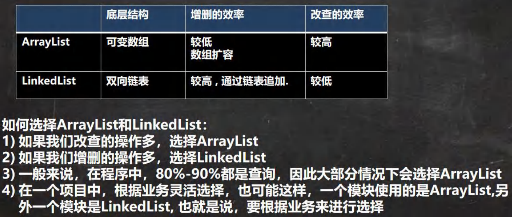

## 介绍

这个比较巧妙

他实现了双向链表，同时也实现了队列的接口

这个好像没什么好写的，重点去看数据结构的链表和队列部分就行了


链表的使用和ArrayList是一样的

主要讲一下队列的使用

队列是先进先出

所以我们插入就从屁股插

```java
LinkedList<Integer> list = new LinkedList<>();
// 插入从屁股插
list.addLast(10);

// 取出数据从头拿
Integer integer = list.removeFirst();

// 查看队列头
Integer first = list.getFirst();

// 查看队列尾
Integer last = list.getLast();

```

