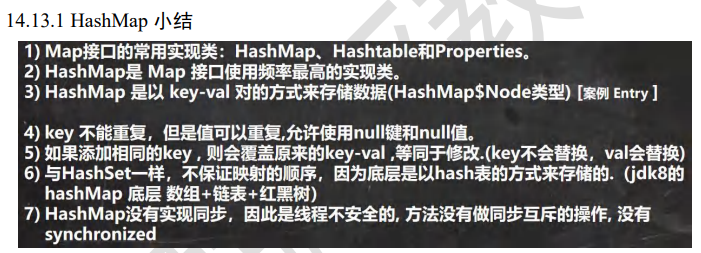
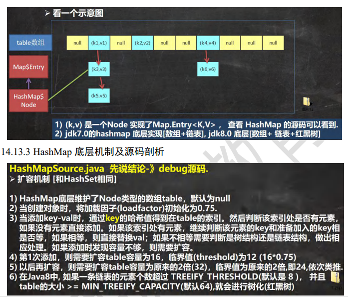

## HashMap

注意key只能有一个为null，value可以有多个

## 常用方法

```java
public static void main(String[] args) {
    HashMap<Integer, String> map = new HashMap<>();

    map.put(1, "小明");
    map.put(2, "小红");
    map.put(3, "小芳");
    map.put(4, null);

    // 获取key中的数据
    System.out.println(map.get(1));

    // 删除
    map.remove(4);
    map.remove(2, "小红");

    // 获取个数
    System.out.println(map.size());

    // 查询是否存在
    System.out.println(map.containsKey(1));


    // 清空map
    map.clear();

    System.out.println(map.toString());
}
```

## 遍历方法

```java
public static void main(String[] args) {
    HashMap<Integer, String> map = new HashMap<>();
    map.put(1, "小明");
    map.put(2, "小红");
    map.put(3, "小芳");


    // 增强for
    for (Map.Entry<Integer, String> entry : map.entrySet()) {
        System.out.println(entry.getKey() + "-" + entry.getValue());
    }

    // 迭代器
    Set<Integer> keySet = map.keySet();
    Iterator<Integer> iterator = keySet.iterator();
    while (iterator.hasNext()) {
        Integer next = iterator.next();
        System.out.println(map.get(next));
    }

    // lambda
    map.forEach((integer, s) -> System.out.println(integer + "-" + s));

    // 获取values
    Collection<String> values = map.values();
    for (String value : values) {
        System.out.println(value);
    }
}
```

## 小结




## 底层



1. 每次扩容的时机，是当前容量大小 * 0.75
2. 初始桶是16
3. 当任意链表长度超过8，并且桶的长度超过64，会转换为红黑树，小于这个数就会
4. 链表采用尾插法（1.8）
5. 链表长度小于等于6，树会开始退化，但是一般得看有没有调用退化方法

https://blog.csdn.net/weixin_42474495/article/details/115522405