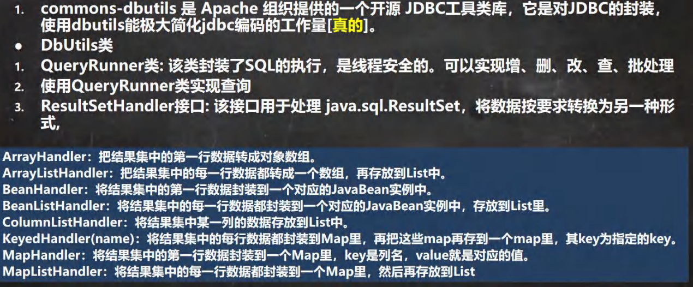

```java
<dependency>
    <groupId>commons-dbutils</groupId>
    <artifactId>commons-dbutils</artifactId>
    <version>1.7</version>
</dependency>
```

```java
@Data
@NoArgsConstructor
@AllArgsConstructor
public class Actor {
    private int id;
    private String name;
    private String sex;
    private LocalDateTime borndate;
    private String phone;
}
```

## 返回List

查询某张表所有数据

```java
public class Main {
    // 使用DBUtils

    // 返回多行数据
    @Test
    public  void testQueryMany() throws SQLException {
        // 得到连接
        Connection connection = DruidUtils.getConnection();
        QueryRunner queryRunner = new QueryRunner();
        String sql = "select * from test.actor";

        // 执行sql语句，得到resultSet，封装到ArrayList集合中
        List<Actor> query = queryRunner.query(connection, sql, new BeanListHandler<>(Actor.class));

        for (Actor actor : query) {
            System.out.println(actor);
        }
        DruidUtils.close(connection);
    }
}
```

## 返回对象

通过id查询某个人

```java
@Test
public void testQuerySingle() throws Exception {
    // 1. 获得properties
    Properties properties = new Properties();
    properties.load(new FileReader("resources/druid.properties"));

    // 2. 得到连接
    DataSource dataSource = DruidDataSourceFactory.createDataSource(properties);
    Connection connection = dataSource.getConnection();

    // 3.创建QueryRunner
    QueryRunner queryRunner = new QueryRunner();

    // 4. sql
    String sql = "select * from test.actor where id = ?";

    // 5. 传入一个BeanHandler，返回单个对象
    Actor actor = queryRunner.query(connection, sql, new BeanHandler<>(Actor.class), 10);
    // 如果返回为空，则查询不到
    System.out.println(actor);
    // 6. 因为queryRunner在底层会帮我们把预处理关闭，我们不用手动关闭
    connection.close();
}
```

## 返回单列的情况

例如查询某个人的名字

```java
// 假如我只需要actor中的name属性，我们不需要把整条记录都拉出来
@Test
public void testQueryOnlyName() throws Exception{
    Properties properties = new Properties();
    properties.load(new FileReader("resources/druid.properties"));
    Connection connection = DruidDataSourceFactory.createDataSource(properties).getConnection();
    String sql = "select name from test.actor where id = ?";
    QueryRunner queryRunner = new QueryRunner();
    Object query = queryRunner.query(connection, sql, new ScalarHandler(), 1);
    System.out.println(query);
    connection.close();
}
```